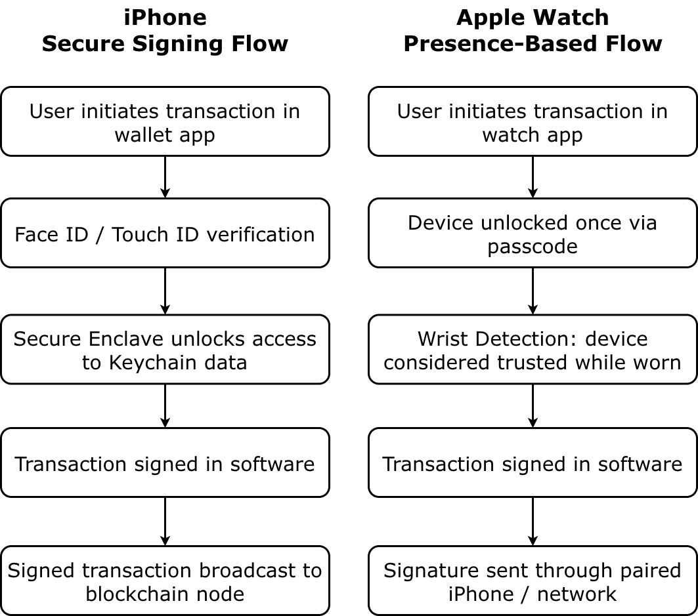
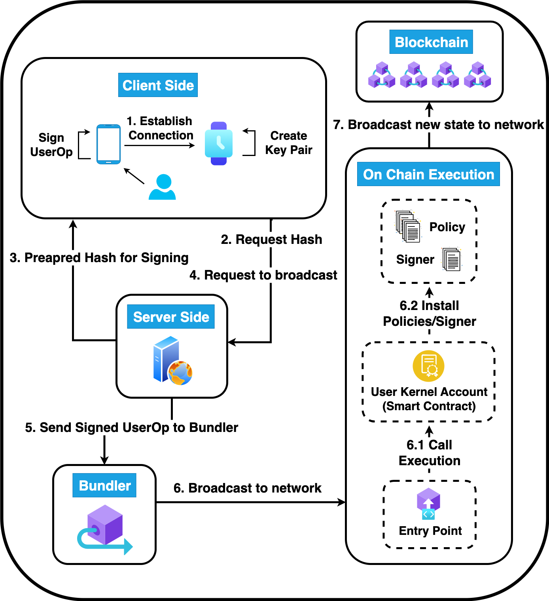

# Dejest: Delegated-Key Wallet Suite

## Project Description

### Core idea and purpose
Dejest explores how smartwatches, specifically Apple Watch, can act as *autonomous Web3 clients* without holding a roor private key. Today, most crypto “watch apps” are read‑only dashboards: they show balances or notifications, but they cannot safely sign transactions. This limitation is not accidental, it stems from a real security problem.

On a phone, critical wallet operations are protected by strong biometrics and secure hardware. On a watch, there is no practical way to require biometric confirmation for every transaction, and the UI surface is tiny. If a traditional EOA private key lives on the watch, a single compromise (malware, stolen device, or accidental approval) can drain the entire wallet.

<div align="center">
  
</div>

Dejest’s goal is to change this trust model: the watch becomes a **constrained, delegated signer**, never the holder of the root key. It can approve certain actions autonomously under strict, verifiable rules, while the primary wallet retains ultimate control.

### Problem statement
The project addresses a combined security and usability problem:
- **Traditional EOAs on smartwatches are unsafe** — an always‑hot key with full control over funds is incompatible with the limited UX and security model of wearables.
- **No per‑transaction verification** — without robust biometrics on every action, a compromised watch key could drain all assets.
- **Users still want convenience** — people want to tap a watch to approve small payments or bounded actions without pulling out their phone for every interaction.

Users need a way to:
- Interact with blockchain actions from a smartwatch.
- Avoid exposing or duplicating the root key on the watch.
- Enforce strict, rule‑based transaction permissions so that even a compromised delegated key cannot bypass limits.

### Conceptual foundation
Dejest builds on ERC‑4337 account abstraction and a kernel‑based smart account:
- The wallet is a **kernel account**, not a simple EOA.
- The account supports multiple keys and policies:
  - **Root key** — full control; can install or revoke modules and delegated keys.
  - **Delegated keys** — restricted keys with rule‑based permissions (CallPolicy).
- The Apple Watch app only ever uses a **delegated key**:
  - It can sign user operations that match pre‑defined rules (allowed tokens, recipients, limits).
  - It cannot bypass those rules or act outside its policy.

This architecture removes the need to store the root key on the watch, while still enabling autonomous signing for low‑risk, constrained actions.

## How It Works (High-Level Architecture)

- **Smartwatch app (Apple Watch)**: Holds a delegated key and signs constrained actions. Communicates with the mobile app via native bridge and receives permission metadata (policy IDs, allowed tokens/recipients).
- **Mobile client (Expo/React Native)**: Orchestrates delegated key creation, shows status, collects user input for call‑policy rules, and talks to the backend. It is the main UX surface.
- **Kernel-based wallet (on-chain)**: ERC‑4337 account using the Kernel architecture and a CallPolicy module to enforce rule‑based permissions for delegated keys.
- **Backend (Express + WebSocket)**: Prepares and broadcasts user operations, checks EntryPoint prefund, queries call‑policy state, and streams installation status to the client/watch.
- **Blockchain / EntryPoint / Bundler**: Executes user operations, enforces the CallPolicy contract, and maintains state under account abstraction.

Data flow (simplified):
1. User configures rules in the mobile app.
2. Mobile + backend assemble user operations for the kernel wallet and CallPolicy.
3. Root key (on phone) signs installation/revocation ops.
4. After installation, watch signs delegated user operations within its policy.
5. Backend submits ops via bundler/EntryPoint; CallPolicy checks rules on‑chain.

### Architecture diagram
<!--  -->
<div align="center">
  
</div>


## Delegation Creation Workflow (Step-by-Step)

### Lifecycle overview
The delegated key lifecycle follows four phases:
1. **Installation** — Create and register a delegated key with a CallPolicy configuration.
2. **Validation** — Ensure limits, tokens, recipients, and policy IDs are correctly installed and visible both on‑chain and to the watch.
3. **Usage** — Watch signs delegated user operations that must pass CallPolicy checks.
4. **Revocation** — Root key (via mobile) can revoke or update delegated keys and policies at any time.

### Detailed installation flow
1. **Initiation**
   - User opens the *Create Delegated Key* screen on mobile.
   - App automatically calls `useSmartWatch.checkConnection()` to ping the watch via `smartWatchBridge.pingWatch`.
2. **Configuration**
   - User chooses key type (sudo vs call‑policy) and device name.
   - For call‑policy keys, user sets:
     - Allowed targets (contracts/addresses).
     - Allowed tokens (native + ERC‑20) and limits (per‑tx, per‑day).
     - Allowed recipients and action types (e.g., transfer only).
3. **Key generation on watch**
   - Mobile builds a `WatchGenarteKeyData` payload (kernel address, optional whitelist and token metadata).
   - `useSmartWatch.requestKeyGeneration` calls `smartWatchBridge.requestKeyGeneration`, which forwards to `WalletBridge.generateKeyPair` on iOS.
   - Watch generates a delegated keypair and returns only the **address** to the app.
4. **Pending device and confirmation**
   - Mobile saves a local record for the new device with `installationStatus: "installing"` and the delegated address.
   - UI shows an address confirmation modal; if confirmed, the app optionally sends a `START_INSTALLATION` message to the watch.
5. **Backend preparation**
   - Mobile sends a delegated‑install request to the backend (`/wallet/delegated/install/prepare-data`) including:
     - Delegated address, key type, call‑policy config, kernel address, and a `clientId` for WebSocket updates.
   - Backend validates the request, checks EntryPoint prefund, and uses kernel/CallPolicy helpers to build unsigned user‑operation batches:
     - Install CallPolicy (if needed).
     - Install delegated permissions.
     - Enable selectors (for restricted keys).
     - Grant access and optional token/recipient updates.
   - Backend returns a structured payload for the client to sign.
6. **Signing and execution**
   - Mobile (root key context) signs the prepared operations.
   - Signed ops are sent to `/wallet/delegated/install/execute`.
   - Backend submits ops via the bundler/EntryPoint and emits WebSocket `status_update` messages (`installing`, `granting`, `completed` or `failed`).
7. **Permission sync to watch**
   - After successful on‑chain installation, mobile constructs `WatchPermissionData` with:
     - `permissionId`, `vId`, `deviceName`, `keyType`, `allowedTokens`, `allowedRecipients`, timestamps.
   - `useSmartWatch.syncPermissionData` calls `smartWatchBridge.syncPermissionData`, which sends metadata to the watch so it can label and enforce the delegated key context.
8. **Finalization**
   - Local device record is updated to `installationStatus: "completed"`.
   - UI shows success; delegated key now appears in the list of devices and can be used for constrained signing from the watch.

### Usage and revocation
- **Usage**:
  - Watch signs a user operation with its delegated key.
  - Op is routed through the kernel account and CallPolicy module.
  - CallPolicy decodes the call, validates token/recipient/value and parameter rules, and rejects anything outside the configured envelope.
- **Revocation/update**:
  - Mobile triggers a revoke or update flow via `/wallet/delegated/revoke/*` or policy‑update endpoints.
  - Root key signs uninstall or policy‑update ops.
  - After confirmed, watch can be notified and local records updated to reflect revoked or changed permissions.

### Delegation sequence diagram
<div align="center">
  
</div>


## Component Connections

- **Smartwatch ↔ Mobile**:
  - Native bridge (`WalletBridge` in `smartWatchBridge.ts`) for ping, key generation, permission sync, and generic payloads.
  - Watch only sees delegated key material and permission metadata, never the root key.
- **Mobile ↔ Backend**:
  - REST endpoints under `/wallet/*` for:
    - Preparing, executing, and revoking delegated installations.
    - Preparing/broadcasting generic user operations.
    - Fetching call‑policy info (allowed tokens, recipients, daily usage).
  - WebSocket (`WebSocketService`) for push `status_update` messages tied to a `clientId`.
- **Backend ↔ Kernel Wallet / EntryPoint**:
  - Uses RPC + ZeroDev SDK to construct and submit ERC‑4337 user operations.
  - Talks to CallPolicy via `native-code` helper functions to read policy state and limits.
- **Rules engine (CallPolicy)**:
  - Enforces:
    - Allowed tokens (including native) and per‑tx/daily token limits.
    - Recipient allow‑lists.
    - Optional parameter rules (e.g., ONE_OF, EQUAL on specific calldata offsets).
  - Rejects any user operation that does not satisfy its constraints, even if signed by a delegated key.


## Repository Structure (with folder READMEs)

- `Dejest/` — Expo/React Native client with Apple Watch integration, delegated‑key flows, and smart‑watch UI. [README](Dejest/README.md)
- `server-side/` — Express + WebSocket backend for delegated install/revoke, call‑policy info, EntryPoint helpers, and user‑op utilities. [README](server-side/README.md)
- `contracts/` — Foundry project with CallPolicy contract, deploy script, and tests. [README](contracts/README.md)
- `kernel_factory/` — Minimal factory for deploying kernel smart accounts as clones. [README](kernel_factory/README.md)
- `diagrams/` — Architecture, sequence, and security diagrams used in docs. [README](diagrams/README.md)

Each folder has its own README explaining internal logic, subcomponents, and usage.

## Setup (quick start)

1) **Contracts** (optional if not deploying locally)

```bash
cd contracts
cp .env.example .env
forge build
```

2) **Server**

```bash
cd server-side
cp .env.example .env
npm install
npm run dev
```

3) **Mobile**

```bash
cd Dejest
cp .env.example .env
npm install
npm run start    # then npm run ios / android / web
```

## Feature Highlights

- Delegated key generation on Apple Watch (iOS bridge).
- Call-policy enforcement: token/recipient allow-lists, per-tx and daily limits.
- WebSocket-driven installation progress updates.
- EntryPoint prefund/deposit utilities.
- ERC-20/native transfer flows with review/confirmation UX.
- Foundry-based CallPolicy contract with deployment script and coverage-focused tests.

## Notes

- Apple Watch bridge is iOS-only; Android returns false/not supported.
- `server-side/dist/` and other build artifacts are gitignored.
- Add your own screenshots in the placeholders above when ready.
